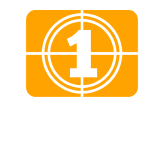

<h1 align="center">App Filmes Favorites</h1>

  <a href="#-tecnologias">Tecnologias</a>&nbsp;&nbsp;&nbsp;|&nbsp;&nbsp;&nbsp;
  <a href="#-projeto">Projeto</a>&nbsp;&nbsp;&nbsp;|&nbsp;&nbsp;&nbsp;
  <a href="#-layout">Layout</a>&nbsp;&nbsp;&nbsp;|&nbsp;&nbsp;&nbsp;
  <a href="#-licença">Licença</a>

<h1 align="center">
  
</h1>

## ✨ Tecnologias

Esse projeto foi desenvolvido com as seguintes tecnologias:

- [Flutter](https://flutter.dev/)
- [Firebase](https://firebase.google.com/)
- [API da  Movie Database (TMDB) ](https://www.themoviedb.org/)

## 💻 Projeto

Aplicativo foi desenvolvido no evento “Dart Week 4ª edição”, ministrado pelo professor “Rodrigo Rahman” da [Academia do Flutter]( http://academiadoflutter.com.br)
- [Arquivo da collection do Postman](./assets/Movies.postman_collection.json)

## 🔖 Layout

Você pode visualizar o layout do projeto através [desse link](https://www.figma.com/file/uxIIdBQowPYx5KS9nGHS4A/Filmes?node-id=15%3A586). É necessário ter conta no [Figma](https://www.figma.com/) para acessá-lo.

## 📝 Licença

Esse projeto está sob a licença MIT.

---

 
